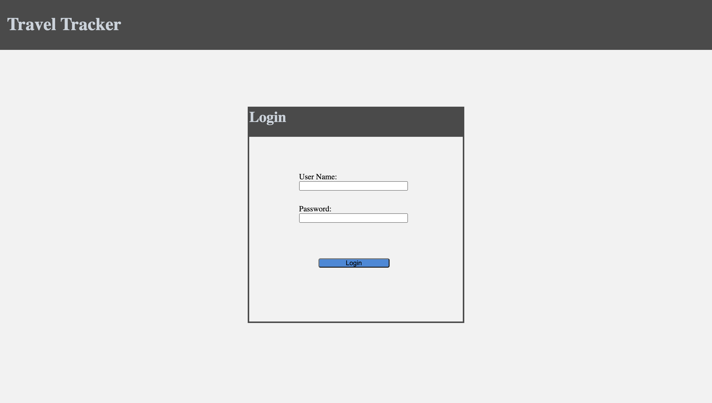
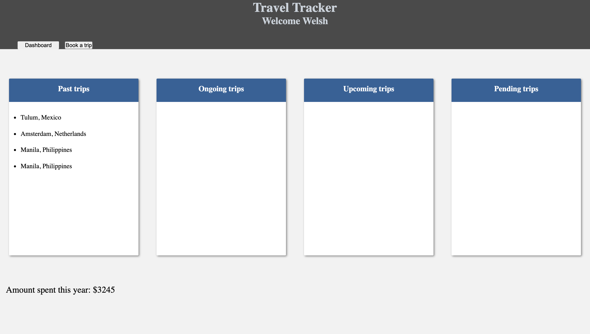
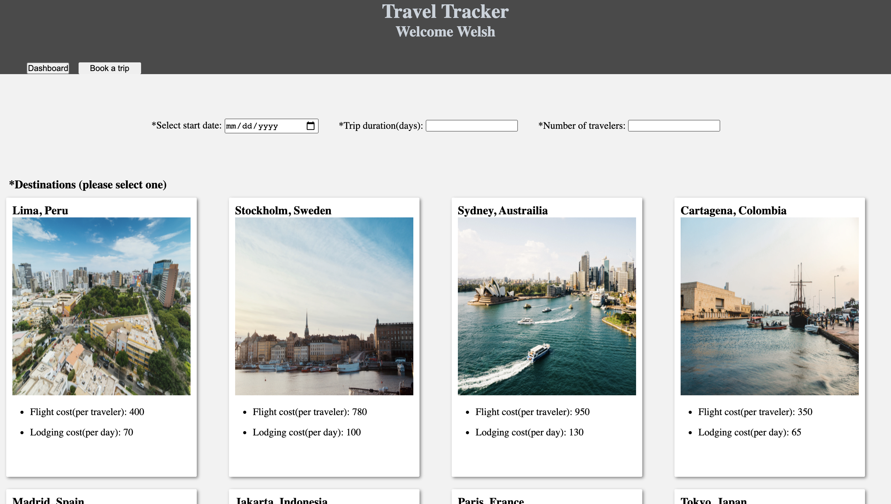
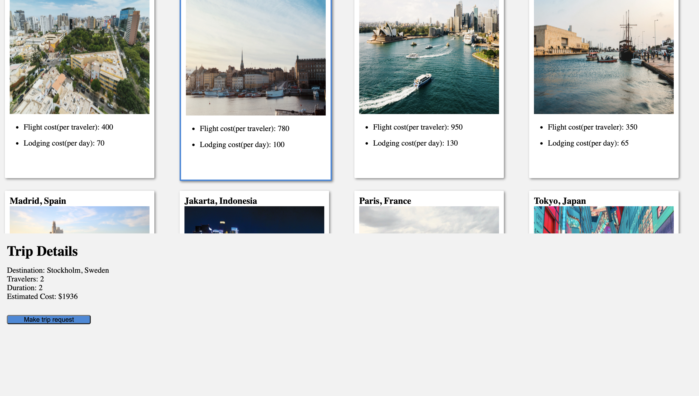

# Travel Tracker

#### Book a trip to one of 50 beautiful locations and keep track of all of your trips in one place!

## Overview

* Travel tracker is a simple Travel app that allows a user to see all of their past, active,
upcoming, and pending trips. The user will also be able to use travel tracker to submit a Travel
request.

## Set-up

* Clone down this repository
* Clone down the [Travel data api](https://github.com/turingschool-examples/travel-tracker-api)
* Move into each directory (in separate terminals) and run npm i, followed by npm start.
* Open [This link](http://localhost:8080/) in your browser.
* Use control + c to stop your local servers from running.

## Project Links

* [Repo](https://github.com/mcraig2342/travel-tracker)

## Contributors

* [Matt Craig](https://github.com/mcraig2342)

## Road Map

##### Future Iterations Should Include:

* An Interface for travel agents to approve/deny trip requests.
* Fully responsive design across multiple browsers.

## Screenshots

Login 
 

Dashboard 
 

Trip Request 
 

Trip Request 
 

